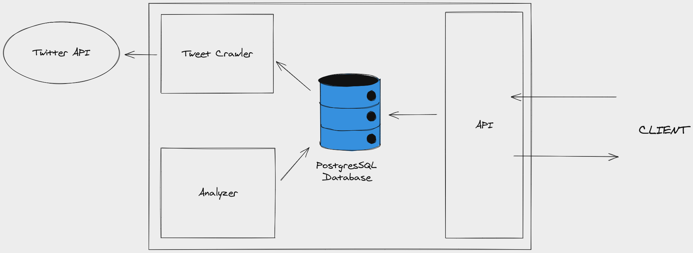

# SQY-Traffic

SQY-Traffic is a real-time traffic disruption analysis based on Tweet scrapping from transporters <a href="https://twitter.com">Twitter</a> account.

The goals of this project are:

- Allowing people to know faster if there is any problem on his route

- Researching a efficient way to analyze and parse traffic data on micro-blogging text, in this case Tweets (~200 characters)

- Providing a simple & scalable solution to expose realtime data to be used by anyone

## Architecture



The solution we designed is divided into 4 parts:

- **PostgresSQL database**: To store different information about the transporters, the tweets scrapped, and the disruptions analyzed

- **Analyzer**: This part determines if a tweet **IS** a disruption, and extracts disruption data from it

- **Tweet Crawler**: Scheduled to call the Twitter API every minute and get the Transporters' newest tweets, it stores them into the database

- **NestJS Typsescript API**: Allows users to get in realtime the newest disruption information available


## Installation

To run SQY-Traffic API, you there is 2 solutions:

#### With Node (Development):

You must have Node >= 15 installed:

```
$ npm install
$ npm start
```


#### With Docker:
- <a href="https://docs.docker.com/engine/install/">How to install Docker</a>

You can build the docker image from source:

```bash
$ git clone https://github.com/Epitech/sqy-traffic.git sqy-traffic
$ cd sqy-traffic
$ docker build -t "sqy-traffic:latest" .
```

Now, You can run the API with the following command:
```bash
$ docker run --rm -it --name -p 3000:3000 "sqy_api" "sqy-traffic:latest"
```

You can also run all the parts with Docker Compose:
```bash
$ docker-compose up --build
```

## Configuration

The API can be configured with different environment variables:

- `PORT` : Port where the API is listening
- `TW_BEARER_TOKEN` : Token delivered by Twitter to access the Twitter API
- `USERNAME_CHECKER` : Twitter Account name to test the connection to the Twitter API
- `TW_API_URL` : URL to the twitter API
- `PG_CONNECTION_STRING` : URL describing the information to connect PostgresSQL database

## Tweet Crawler

To get realtime information, it is needed to get frequently the newest tweets to be parsed by the analyzer. We created to do a scheduled task to fetch and store them from the Twitter API. To be sure we scrapped all the tweets published, we set the delay between each fetch cycle to 1 minute.

## Analyzer

The Analyzer service is the core of SQY-Traffic solution, so we imagined several way of research in order to get a result of extraction quite accurate  ready for a production context.

#### How to obtain relevant inforation from tweets ?

There are several difficulties to parse tweets with the purpose of extracting several data. The main one is certainly the non-linearity of the content of the tweet.

Indeed, the content can be incomplete, can be written in different format, and can incorporate a context, only understable by human. Tweet is a human-written text, addressed to another human. The perception of all the information passed into the tweet is easier for a human, even if information is omitted. Nonetheless, it's impossible for the computer to do it alone.

The 1st parsing prototype is based on <a href="https://en.wikipedia.org/wiki/Regular_expression">regular expression</a> (**RegExp**) :

This solution was eligible because even if we don't know the context of the tweet or some information are missing, the way to write specific data such as dates, intervals or public transport line affected is limited and some patterns are repeated.

Therefore, we wrote sets of regex to handle the maximum of patterns we want to match with.

Here some visual examples of what we could parse:


#### Why did we conclude that RegExp was not a good idea? 

Creating regular expressions for all the patterns we could is an heavy task and it may too much time to add, fix and update them frequently. Another problem comes from Twitter and micro-blogging texts : They are not always written in pure letters and grammatically correct language. It can be used some emoticons or abbreviations that make sense for a human but for detecting patterns.

These elements make regular expressions not usable for a production context.

#### Are there others solutions to test ?

| NLP: Regular Expressions (RegExp) | NLP: Natural Language Understanding (NLU) |
| -------------------------| ------------------------ |
|            :x:           |     Not tested           |


## Contributors

- <a href="https://github.com/TheoHertz">Théo Hinsinger</a>
- <a href="https://github.com/pr0m3th3usEx">Thomas Michel</a>
- <a href="https://github.com/JeromeCGithub">Jérôme Collet</a>
- <a href="https://github.com/TomChv">Tom Chauveau</a>